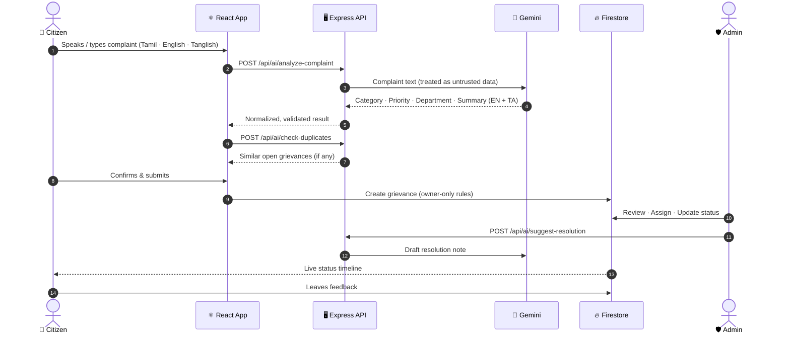
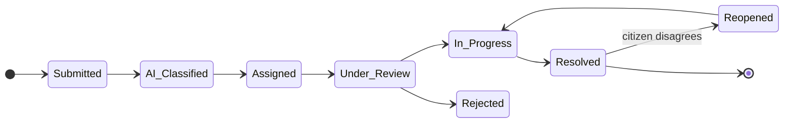

<div align="center">


<br/>

[](https://react.dev)
[](https://www.typescriptlang.org)
[](https://vitejs.dev)
[](https://tailwindcss.com)
<br/>
[](https://ai.google.dev)
[](https://firebase.google.com)
[](https://expressjs.com)
[](https://nodejs.org)


### 🗣️ Speak it &nbsp;→&nbsp; 🤖 AI understands it &nbsp;→&nbsp; 🏛️ Right department fixes it &nbsp;→&nbsp; 📍 You track it

**[🚀 Quick Start](#-quick-start)** · **[✨ Features](#-features)** · **[🏗️ Architecture](#%EF%B8%8F-architecture)** · **[🔐 Security](#-security)** · **[🤝 Contributing](#-contributing)**

</div>


## 📖 About

**NivaranAI** (*nivaran* = "resolution" in Hindi/Tamil) is an AI-assisted civic grievance management platform. Citizens describe a problem in their own words — by **voice or text, in Tamil, English or Tanglish** — and the platform uses **Google Gemini** to understand it, categorize it, set a priority, and route it to the right municipal department. Citizens then track it in real time, while administrators manage the full resolution workflow from a protected dashboard.

> **The problem:** Citizens often don't know which department owns a pothole, a burst pipe or a dead street light — and complaints get lost in the gap.
> **The fix:** Say it once. NivaranAI figures out the rest.


## 🎬 How It Works

<div align="center">

</div>

<br/>




## ✨ Features

<table>
<tr>
<td width="50%" valign="top">

### 👥 For Citizens
- 🎙️ **Voice complaints** via the Web Speech API — Tamil & English
- ⌨️ **Text fallback** when voice isn't convenient
- 🤖 **Instant AI analysis** — category, priority, department, bilingual summary
- 🔁 **Duplicate detection** before you submit
- 📍 **Location capture** and image evidence (one image, < 400 KB)
- 🔎 **Track by ID** with a full status timeline
- 📚 **My Grievances** history
- ⭐ **Feedback** after resolution
- 🌐 **Bilingual UI** — English / தமிழ்
- 🔒 **No sign-up needed** — private anonymous sessions

</td>
<td width="50%" valign="top">

### 🛡️ For Administrators
- 🔐 **Protected admin login** — verified email + active admin registry
- 📋 **Grievance dashboard** with filters, search & CSV export
- 👮 **Assign** to departments & officers
- 🔄 **8-stage status workflow** with remarks & audit history
- 💡 **AI-drafted resolution notes** (human-verified)
- 📊 **Analytics & SLA views** computed from real records
- 🗺️ **Interactive hotspot map**
- 🧯 **CSV formula-injection protection** on export
- 🔑 **Admin password reset** flow

</td>
</tr>
</table>

### 🗂️ Smart Categories

| | | |
|---|---|---|
| 💡 Street Light | 💧 Water Supply | 🛣️ Roads & Potholes |
| 🚰 Sanitation & Drainage | ⚡ Electricity & Power | 🦟 Public Health & Fogging |
| 🚦 Transport & Traffic | 🌳 Encroachment & Parks | 📌 Other |

### 🚦 Priority & Status Lifecycle



Priorities: 🔴 **Critical** · 🟠 **High** · 🟡 **Medium** · 🟢 **Low**


## 🏗️ Architecture

<div align="center">

</div>

### 🧰 Tech Stack

| Layer | Technology |
|---|---|
| **Frontend** | React 19, TypeScript, Vite 6, Tailwind CSS 4, Motion, Recharts, Lucide, canvas-confetti |
| **Backend** | Node.js 22, Express 4, `tsx` (dev), `esbuild` (prod bundle) |
| **AI** | Google Gemini via `@google/genai` (server-side only) |
| **Auth** | Firebase Authentication — anonymous citizens, email/password admins |
| **Database** | Cloud Firestore with least-privilege security rules |
| **CI** | GitHub Actions — install, type-check, production build |

### 📁 Project Structure

```text
├── server.ts                  # Express server: AI endpoints, auth guards, security headers
├── firestore.rules            # Least-privilege Firestore security rules
├── firebase-blueprint.json    # Firestore data model
├── scripts/
│   └── provision-admin.mjs    # Grants admin access to a Firebase user
├── src/
│   ├── App.tsx
│   ├── components/
│   │   ├── HeroSection.tsx        # Landing page
│   │   ├── VoiceInputModal.tsx    # Tamil/English speech capture
│   │   ├── GrievanceForm.tsx      # AI-assisted filing flow
│   │   ├── CitizenTracker.tsx     # Status timeline
│   │   ├── CitizenHistory.tsx     # My grievances
│   │   ├── AdminLogin.tsx         # Protected admin sign-in
│   │   ├── AdminDashboard.tsx     # Admin workflow
│   │   ├── AnalyticsView.tsx      # Charts & SLA
│   │   ├── InteractiveMap.tsx     # Hotspot map
│   │   └── LegalPage.tsx          # Privacy · Terms · Cookies
│   ├── context/AppContext.tsx     # Global state (language, auth, navigation)
│   ├── services/api.ts            # API + Firestore client
│   ├── locales/translations.ts    # English / தமிழ் strings
│   └── types.ts
└── .github/workflows/         # CI pipeline
```


## 🚀 Quick Start

### Prerequisites
- **Node.js 22+**
- A **Firebase** project (Authentication + Firestore)
- A **Google Gemini API key** → [Get one here](https://aistudio.google.com/apikey)

### 1️⃣ Clone & install
```bash
git clone https://github.com/YOUR_USERNAME/YOUR_REPO.git
cd YOUR_REPO
npm install
```

### 2️⃣ Configure environment
```bash
cp .env.example .env
```

| Variable | Description |
|---|---|
| `GEMINI_API_KEY` | Gemini API key — **server-only**, never sent to the browser |
| `FIREBASE_SERVICE_ACCOUNT_JSON` | Firebase Admin service-account JSON (single line) |
| `ADMIN_EMAILS` | Comma-separated allowlist of admin emails for server-side APIs |

> Client-safe Firebase config lives in `firebase-applet-config.json`. Replace it with **your own** Firebase project's config.

### 3️⃣ Set up Firebase
1. In the Firebase console, enable **Authentication → Anonymous** and **Email/Password**.
2. Create the Firestore database and deploy the rules:
   ```bash
   firebase deploy --only firestore:rules
   ```
3. Create an admin user in Firebase Authentication and **verify their email**.
4. Provision admin access:
   ```bash
   npm run provision-admin -- admin@example.com
   ```

### 4️⃣ Run it
```bash
npm run dev          # development server → http://localhost:3000
```

```bash
npm run build        # production build (Vite + bundled server)
npm start            # run the production server
npm run lint         # TypeScript type-check
```


## 🔐 Security

Security was treated as a first-class feature, not an afterthought:

| Area | Protection |
|---|---|
| 🔑 **Secrets** | Gemini key and Firebase Admin credentials stay server-side |
| 🛡️ **Firestore** | Citizens read/write only their own grievances; admin registry is not writable from clients |
| 👮 **Admin access** | Verified email + active `admins/{uid}` record + server allowlist |
| 🚦 **API** | Rate limiting, 1 MB body cap, 10 000-char AI input cap |
| 🧱 **Headers** | CSP, HSTS, frame protection, `nosniff`, Referrer-Policy, Permissions-Policy |
| 🧠 **AI safety** | Complaint text treated as untrusted; output normalized to allowed categories, priorities & departments |
| 📄 **CSV export** | Neutralizes `=`, `+`, `-`, `@` formula injection |
| 🖼️ **Uploads** | One image, size-capped, enforced in Firestore rules |

> ⚠️ **AI output is assistive.** Consequential administrative actions should always be verified by a human.
>
> ⚠️ **Compliance:** the included Privacy / Terms pages are templates, not legal advice. Review them against your own data flows and applicable law (e.g. India's DPDP Act, 2023) before going live. See [`PRODUCTION_AUDIT.md`](PRODUCTION_AUDIT.md) for the full audit and launch checklist.


## 🗺️ Roadmap

- [ ] Move evidence uploads to dedicated object storage (Firebase Storage / GCS)
- [ ] Persistent, access-controlled notification store (SMS / email / push)
- [ ] Additional Indian languages (Hindi, Telugu, Kannada, Malayalam)
- [ ] Officer field-app with photo proof of resolution
- [ ] Automated tests & end-to-end browser coverage
- [ ] Public transparency dashboard

## 🤝 Contributing

Contributions are welcome!

1. 🍴 Fork the repository
2. 🌿 Create a branch: `git checkout -b feature/amazing-idea`
3. 💾 Commit: `git commit -m "feat: add amazing idea"`
4. 📤 Push: `git push origin feature/amazing-idea`
5. 🔀 Open a Pull Request

Please run `npm run lint` before submitting.

## 📄 License

Distributed under the **MIT License**. Add a `LICENSE` file to your repository to make this official.

## 🙏 Acknowledgements

[Google Gemini](https://ai.google.dev) · [Firebase](https://firebase.google.com) · [React](https://react.dev) · [Vite](https://vitejs.dev) · [Tailwind CSS](https://tailwindcss.com) · [Recharts](https://recharts.org) · [Lucide](https://lucide.dev) · [Shields.io](https://shields.io)

<div align="center">


**Built with ❤️ for citizens who deserve to be heard.**

⭐ **If this project helps you, give it a star!** ⭐


</div>

