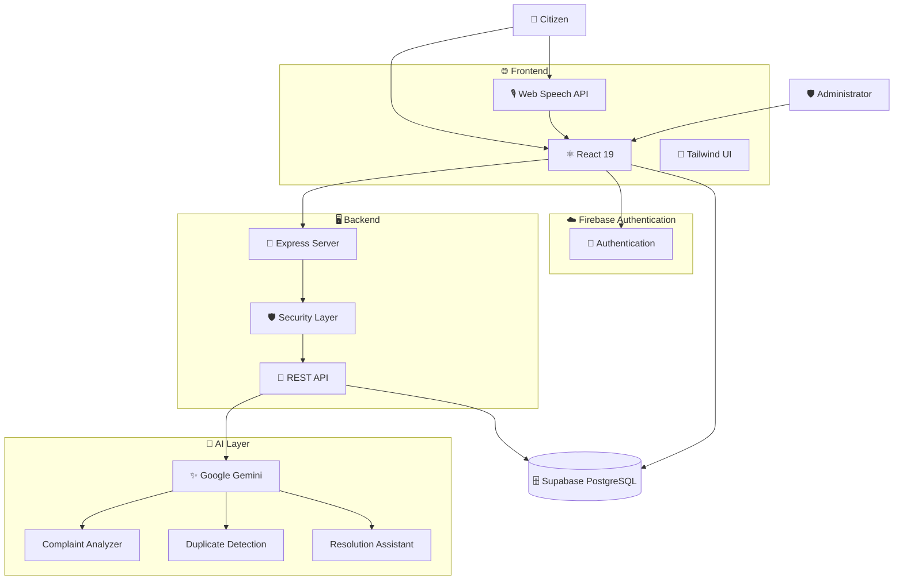

<div align="center">

# 🏛️ NivaranAI

### 🚀 AI-Powered Citizen Grievance Platform

> **Trust & compliance note:** This is a pre-production civic software project. It does not claim government ownership, legal compliance, official service status, or customer/testimonial metrics. The production operator must configure its identity, privacy contact, retention policy and applicable legal notices.

<p>
  <strong>Speak it.</strong> &nbsp;→&nbsp;
  <strong>AI understands it.</strong> &nbsp;→&nbsp;
  <strong>Department receives it.</strong> &nbsp;→&nbsp;
  <strong>Citizen tracks it.</strong>
</p>

<br>


<br>

[](https://github.com/leopears2008-cell/AI-powered-citizen-grievance-platform)
[](https://react.dev/)
[](https://www.typescriptlang.org/)
[](https://vite.dev/)
[](https://firebase.google.com/)
[](https://ai.google.dev/)

<br>


</div>

> **Pre-production project:** This repository is not affiliated with a government and does not establish an official complaint channel. The deploying organization must configure its identity, support contact, Firebase project, and operational processes before public use.

---

## 🌟 What is NivaranAI?

**NivaranAI** is a modern AI-powered civic grievance platform designed to make it easier for citizens to report public issues and track their resolution.

Instead of navigating complicated government systems, citizens can simply **type or speak their problem** in:

🇬🇧 English  
🇮🇳 தமிழ் Tamil  
💬 Tanglish

The AI analyzes the complaint, identifies the issue, determines its priority, recommends the responsible department, and helps administrators manage the grievance.

<br>

<div align="center">

### 💡 From Complaint → Resolution

```text
👤 Citizen
     │
     ▼
🗣️ Voice / Text Complaint
     │
     ▼
🧠 Gemini AI Analysis
     │
     ├── 🏷️ Category
     ├── 🚦 Priority
     ├── 🏛️ Department
     └── 📝 Summary
     │
     ▼
🔁 Duplicate Detection
     │
     ▼
🏢 Department Assignment
     │
     ▼
🛠️ Resolution
     │
     ▼
📍 Citizen Tracking
```

</div>

---

# ✨ Why NivaranAI?

<table>
<tr>
<td width="50%">

### 🗣️ Natural Complaint Filing

Citizens don't need to understand complex government forms.

Simply describe the problem naturally using **voice or text**.

</td>

<td width="50%">

### 🧠 AI-Powered Understanding

Gemini analyzes the complaint and extracts useful information automatically.

</td>
</tr>

<tr>
<td>

### 🏛️ Smart Department Routing

The platform identifies the appropriate department based on the grievance category.

</td>

<td>

### 📍 Transparent Tracking

Citizens can follow their grievance through a clear status timeline.

</td>
</tr>

<tr>
<td>

### 🔁 Duplicate Detection

Similar open complaints can be identified before creating unnecessary duplicate records.

</td>

<td>

### 📊 Administrator Analytics

Authorized administrators use dashboards, analytics, filters, and grievance management tools; a separate officer identity/permission model is not configured.

</td>
</tr>
</table>

---

# 🚀 Core Features

## 👤 Citizen Portal

| Feature | Description |
|---|---|
| 🎙️ **Voice Filing** | Submit complaints using speech |
| ⌨️ **Text Filing** | Submit complaints manually |
| 🧠 **AI Analysis** | Automatically understand complaints |
| 🏷️ **Category Detection** | Identify the type of issue |
| 🚦 **Priority Detection** | Determine urgency |
| 🏛️ **Department Routing** | Recommend responsible department |
| 🔁 **Duplicate Detection** | Find similar grievances |
| 📍 **Location Support** | Capture issue location |
| 🖼️ **Evidence Upload** | Attach supporting images |
| 🔎 **Grievance Tracking** | Track complaint status |
| ⭐ **Feedback** | Citizen satisfaction feedback |
| 🌐 **Multilingual UI** | English + Tamil |
| 🔒 **Anonymous browsing** | Browsing is anonymous; a verified phone or email is required before submitting a grievance |

---

# 🛡️ Admin Dashboard

Administrators can manage the complete grievance lifecycle.

### 📋 Grievance Management

- View all grievances
- Search grievances
- Filter by category
- Filter by priority
- Filter by department
- Assign officers
- Update grievance status
- Add administrative remarks
- Review grievance history
- Export grievance data

### 📊 Analytics

```text
┌─────────────────────────────────────────────┐
│              ADMIN ANALYTICS                │
├─────────────────────────────────────────────┤
│                                             │
│  📋 Total        🟢 Resolved    🔴 Pending │
│                                             │
│  📈 Resolution Rate                          │
│                                             │
│  🏛️ Department Performance                  │
│                                             │
│  🗺️ Grievance Hotspots                      │
│                                             │
│  ⏱️ SLA Monitoring                           │
│                                             │
└─────────────────────────────────────────────┘
```

---

# 🧠 AI Intelligence

NivaranAI uses AI as an **assistive intelligence layer**.

### AI Processing Pipeline

```text
              ┌──────────────────┐
              │  Citizen Input   │
              │  Voice / Text    │
              └────────┬─────────┘
                       │
                       ▼
              ┌──────────────────┐
              │ Input Validation │
              └────────┬─────────┘
                       │
                       ▼
              ┌──────────────────┐
              │   Gemini AI      │
              │   Analysis       │
              └────────┬─────────┘
                       │
          ┌────────────┼────────────┐
          ▼            ▼            ▼
      🏷️ Category   🚦 Priority   🏛️ Department
          │            │            │
          └────────────┼────────────┘
                       ▼
              ┌──────────────────┐
              │ Structured Data  │
              └────────┬─────────┘
                       │
                       ▼
              🔁 Duplicate Check
                       │
                       ▼
                 👤 Confirmation
                       │
                       ▼
                 🗄️ Supabase PostgreSQL
```

---

# 🏷️ Smart Grievance Categories

| 🏷️ Category | Example |
|---|---|
| 💡 Street Light | Broken / non-working lights |
| 🚦 Traffic | Signals, signage and traffic issues |
| 💧 Water Supply | Water shortage or leakage |
| 🌳 Parks & Encroachment | Park maintenance / illegal occupation |
| 🛣️ Roads & Potholes | Damaged roads |
| ⚡ Electricity | Power-related complaints |
| 🚰 Sanitation | Garbage and drainage |
| 🦟 Public Health | Mosquito and fogging requests |
| 📌 Other | Other civic issues |

---

# 🚦 Grievance Lifecycle

```text
     ┌──────────────┐
     │ 📝 Submitted │
     └──────┬───────┘
            ▼
     ┌──────────────┐
     │ 🧠 AI        │
     │ Classified   │
     └──────┬───────┘
            ▼
     ┌──────────────┐
     │ 🏛️ Assigned  │
     └──────┬───────┘
            ▼
     ┌──────────────┐
     │ 🔍 Reviewing │
     └──────┬───────┘
            ▼
     ┌──────────────┐
     │ 🛠️ Progress  │
     └──────┬───────┘
            ▼
     ┌──────────────┐
     │ ✅ Resolved  │
     └──────────────┘
```

If a citizen disagrees with the resolution:

```text
Resolved
   │
   ▼
Reopened
   │
   ▼
In Progress
```

---

# 🏗️ System Architecture



---

# 🧰 Technology Stack

<div align="center">

| Layer | Technology |
|---|---|
| 🎨 **Frontend** | React 19 |
| 🟦 **Language** | TypeScript |
| ⚡ **Build Tool** | Vite 6 |
| 🎨 **Styling** | Tailwind CSS |
| 🧠 **AI** | Google Gemini |
| 🔥 **Database** | Supabase PostgreSQL |
| 🔐 **Authentication** | Firebase Authentication |
| 🚀 **Backend** | Node.js + Express |
| 🎙️ **Voice** | Web Speech API |
| 📊 **Charts** | Recharts |
| 🎨 **Icons** | Lucide |
| 🔄 **CI/CD** | GitHub Actions |

</div>

---

# 📁 Project Structure

```text
AI-powered-citizen-grievance-platform/
│
├── 📁 .github/
│   └── 📁 workflows/
│
├── 📁 src/
│   ├── 📁 components/
│   │   ├── HeroSection.tsx
│   │   ├── VoiceInputModal.tsx
│   │   ├── GrievanceForm.tsx
│   │   ├── CitizenTracker.tsx
│   │   ├── CitizenHistory.tsx
│   │   ├── AdminLogin.tsx
│   │   ├── AdminDashboard.tsx
│   │   ├── AnalyticsView.tsx
│   │   ├── InteractiveMap.tsx
│   │   └── LegalPage.tsx
│   │
│   ├── 📁 context/
│   │   └── AppContext.tsx
│   │
│   ├── 📁 services/
│   │   └── api.ts
│   │
│   ├── 📁 locales/
│   │   └── translations.ts
│   │
│   ├── App.tsx
│   └── types.ts
│
├── 📁 scripts/
│   └── provision-admin.mjs
│
├── server.ts
├── firestore.rules
├── firebase-blueprint.json
├── package.json
├── vite.config.ts
├── tsconfig.json
└── README.md
```

---

# 🚀 Production Deployment: Vercel Frontend + Separate Express Backend

The production deployment is intentionally split:

    Citizen
      ↓
    Vercel
      ↓
    React/Vite frontend
      ↓ HTTPS + Firebase ID token
    Separate Express API
      ↓
    Gemini API
      ↓
    Firebase Admin / Supabase PostgreSQL

## Frontend — Vercel

Set these Vercel environment variables:

    VITE_API_URL=https://<your-backend-domain>
    VITE_FIREBASE_API_KEY=<Firebase Web API key>
    VITE_FIREBASE_AUTH_DOMAIN=<Firebase auth domain>
    VITE_FIREBASE_PROJECT_ID=<Firebase project id>
    VITE_FIREBASE_STORAGE_BUCKET=<Firebase storage bucket>
    VITE_FIREBASE_MESSAGING_SENDER_ID=<Firebase sender id>
    VITE_FIREBASE_APP_ID=<Firebase app id>
    VITE_FIRESTORE_DATABASE_ID=<optional database id>

VITE_* values are browser-visible configuration. Never put the Firebase Admin service-account JSON or Gemini API key in a VITE_* variable.

Vercel uses vercel.json and runs:

    npm run build:client

## Backend — Render

This repository includes render.yaml. Create a Render Web Service from the repository, or use the Blueprint configuration.

Set these server-only variables:

    GEMINI_API_KEY=<Gemini API key>
    FIREBASE_SERVICE_ACCOUNT_JSON=<Firebase Admin service-account JSON>
    FIRESTORE_DATABASE_ID=<optional database id>
    ADMIN_EMAILS=<comma-separated verified admin emails>
    CORS_ORIGINS=https://<your-vercel-domain>

The backend runs:

    npm run build:server
    npm start

Health check:

    GET /healthz

The backend is API-only in production (SERVE_CLIENT=false). The browser sends Firebase ID tokens in the Authorization: Bearer ... header.

## Deployment order

1. Deploy the backend first and copy its HTTPS URL.
2. Add that URL to Vercel as VITE_API_URL.
3. Deploy the Vercel frontend.
4. Copy the final Vercel domain into backend CORS_ORIGINS.
5. Add the Vercel domain to Firebase Authentication authorized domains.
6. Verify GET /healthz, Firebase login, complaint submission, AI analysis, duplicate detection, and admin-only resolution drafting.

# ⚡ Quick Start

## 1️⃣ Clone

```bash
git clone https://github.com/leopears2008-cell/AI-powered-citizen-grievance-platform.git

cd AI-powered-citizen-grievance-platform
```

## 2️⃣ Install Dependencies

```bash
npm install
```

## 3️⃣ Configure Environment Variables

Create:

```text
.env
```

Example:

```env
GEMINI_API_KEY=your_gemini_api_key

FIREBASE_SERVICE_ACCOUNT_JSON=your_service_account_json

ADMIN_EMAILS=admin@example.com
```

> 🔐 **Never commit `.env` or Firebase service-account credentials to GitHub.**

## 4️⃣ Firebase Setup

Enable:

```text
🔥 Firebase Authentication
🔥 Anonymous Authentication (browsing only)
🔥 Phone Authentication (OTP)
🔥 Email/Password Authentication
🔥 Cloud Supabase PostgreSQL
```

Deploy Supabase PostgreSQL rules:

```bash
firebase deploy --only firestore:rules
```

## 5️⃣ Run the Application

```bash
npm run dev
```

Open:

```text
http://localhost:3000
```

---

# 📜 Available Commands

| Command | Purpose |
|---|---|
| `npm run dev` | Start development server |
| `npm run build` | Production build |
| `npm start` | Start production server |
| `npm run lint` | Check TypeScript |
| `npm run provision-admin -- <email>` | Create admin access |

---

# 🔌 API

### Analyze Complaint

```http
POST /api/ai/analyze-complaint
```

### Check Duplicates

```http
POST /api/ai/check-duplicates
```

### Suggest Resolution

```http
POST /api/ai/suggest-resolution
```

Example:

```bash
curl -X POST http://localhost:3000/api/ai/analyze-complaint \
-H "Authorization: Bearer <FIREBASE_ID_TOKEN>" \
-H "Content-Type: application/json" \
-d '{"text":"Anna Nagar street light is not working"}'
```

---

# 🔐 Security

NivaranAI separates sensitive operations from the public client.

### 🔒 Security Measures

- Firebase Authentication
- Admin authorization
- Supabase PostgreSQL security rules
- Server-side Gemini API calls
- Rate limiting
- Request-size limits
- Security headers
- Input validation
- AI output normalization
- CSV formula-injection protection
- Restricted administrator operations

```text
                    REQUEST
                       │
                       ▼
                🛡️ Rate Limit
                       │
                       ▼
               📦 Body Validation
                       │
                       ▼
              🔑 Firebase Token
                       │
                       ▼
        👤 Verified Citizen Claim
  📱 Phone OTP or 📧 verified email
                       │
                       ▼
             ┌─────────┴─────────┐
             │                   │
          Citizen              Admin
             │                   │
             ▼                   ▼
       Citizen APIs        Admin APIs
```

---

## 🔐 Citizen verification and complaint submission

Filing a complaint requires Firebase Authentication verification by mobile OTP or verified email. Phone sign-in uses Firebase Phone Authentication with reCAPTCHA; this app does not generate or store OTP codes. Ten-digit phone entries default to India (+91); other countries use E.164 phone format. Email registration/sign-in uses Firebase Email/Password Authentication and requires Firebase to report `emailVerified` after refreshing the user.

The browser and `api.createComplaint` block unverified submissions, and `firestore.rules` also validates the matching phone-number or verified-email claim in the Firebase ID token. Anonymous sessions are limited to browsing. Contact fields are sourced from Firebase Authentication where verified; this feature does not duplicate them into a Supabase PostgreSQL `users` collection.

In Firebase Console, enable **Phone** and **Email/Password** providers, add localhost and approved production hosts to Authorized domains, review SMS regions/quotas, and configure verification email templates/action URLs. SMS/email delivery must be tested using the service operator's own Firebase project. Only client-safe Firebase web configuration belongs in `VITE_FIREBASE_*` settings; Firebase Admin credentials stay server-side.

---

# 🖼️ Screenshots

Add your screenshots inside:

```text
docs/screenshots/
```

Recommended:

```text
docs/screenshots/
├── landing.png
├── filing.png
├── tracker.png
├── admin.png
├── analytics.png
└── map.png
```

Then display them like:

```markdown
## 🏠 Landing Page


## 🤖 AI Grievance Filing


## 📍 Citizen Tracking


## 🛡️ Admin Dashboard


```

---

# 🗺️ Roadmap

### ✅ Completed

- [x] AI grievance classification
- [x] Voice complaint filing
- [x] Text complaint filing
- [x] Department routing
- [x] Priority detection
- [x] Duplicate detection
- [x] Citizen tracking
- [x] Admin dashboard
- [x] Analytics
- [x] Interactive map
- [x] Firebase authentication
- [x] Supabase PostgreSQL database
- [x] Tamil support

### 🚀 Future

- [ ] Hindi support
- [ ] Telugu support
- [ ] Kannada support
- [ ] Malayalam support
- [ ] SMS notifications
- [ ] WhatsApp notifications
- [ ] Push notifications
- [ ] Officer mobile application
- [ ] Photo proof of resolution
- [ ] Automated E2E testing
- [ ] Public transparency dashboard
- [ ] Advanced AI analytics

---

# 🤝 Contributing

Contributions are welcome!

```bash
# Fork the repository

# Create a branch
git checkout -b feature/my-feature

# Make your changes

# Check the project
npm run lint

# Commit
git commit -m "feat: add new feature"

# Push
git push origin feature/my-feature
```

Then open a Pull Request.

---

# 🛡️ Responsible AI

NivaranAI uses AI to **assist** citizens and administrators.

AI-generated classifications, priorities and recommendations should be reviewed by authorized personnel when they affect consequential administrative decisions.

The platform should not be treated as a replacement for official human decision-making.

---

# 📄 License

This project is licensed under the **MIT License**.

See [`LICENSE`](LICENSE) for details.

---

# ❤️ Acknowledgements

Built using:

- ⚛️ React
- 🟦 TypeScript
- ⚡ Vite
- 🎨 Tailwind CSS
- 🧠 Google Gemini
- 🔥 Firebase
- 🚀 Express
- 📊 Recharts
- 🎨 Lucide

---

<div align="center">


### 🌍 Technology for Better Public Services

**NivaranAI — Making civic grievance reporting simpler, smarter and more transparent.**

<br>

⭐ **If you find this project useful, consider starring the repository.**

<br>

<a href="https://github.com/leopears2008-cell/AI-powered-citizen-grievance-platform">

</a>

</div>
