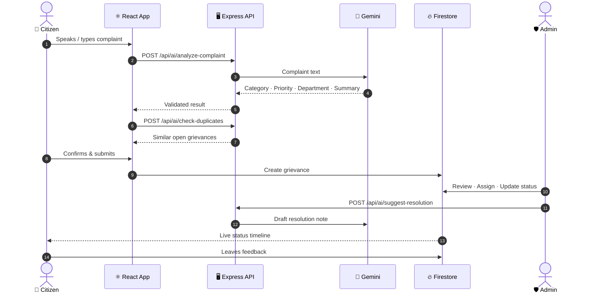
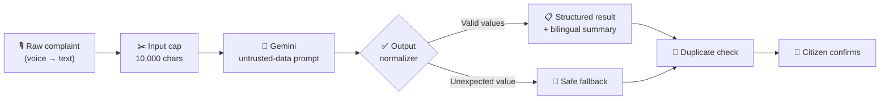
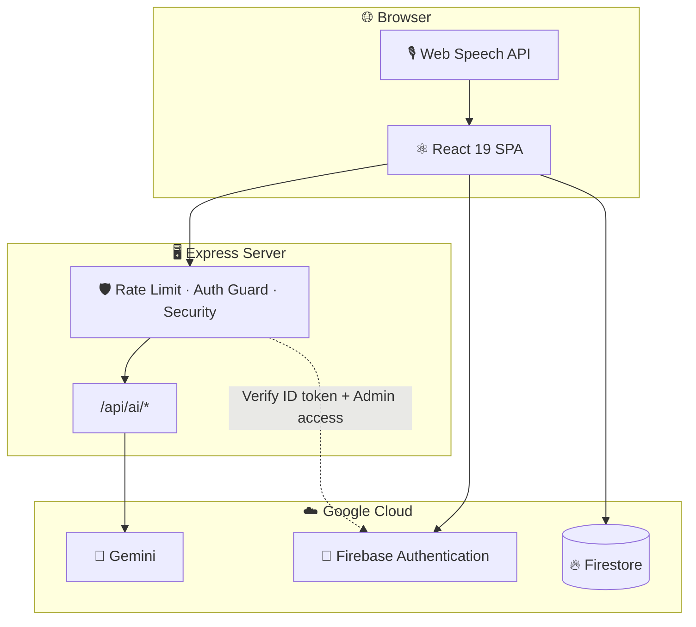
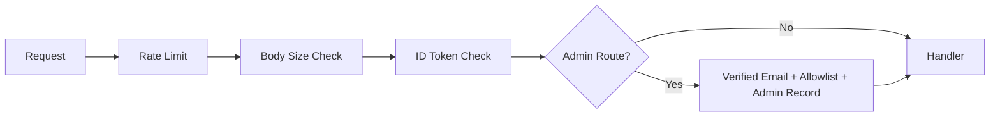

<div align="center">


<br/>

**Speak it in Tamil, English or Tanglish. AI routes it to the right department. You track it to resolution.**

<br/>

[](https://github.com/leopears2008-cell/AI-powered-citizen-grievance-platform/actions)
[](LICENSE)
[](#-contributing)
[](https://github.com/leopears2008-cell/AI-powered-citizen-grievance-platform/stargazers)

[](https://react.dev)
[](https://www.typescriptlang.org)
[](https://vitejs.dev)
[](https://tailwindcss.com)
[](https://ai.google.dev)
[](https://firebase.google.com)
[](https://expressjs.com)
[](https://nodejs.org)

**[🚀 Quick Start](#-quick-start)** · **[✨ Features](#-features)** · **[🏗️ Architecture](#%EF%B8%8F-architecture)** · **[🔐 Security](#-security)** · **[🤝 Contributing](#-contributing)**

</div>


## 📑 Table of Contents

- [About](#-about)
- [At a Glance](#-at-a-glance)
- [How It Works](#-how-it-works)
- [Features](#-features)
- [Screenshots](#-screenshots)
- [Architecture](#%EF%B8%8F-architecture)
- [Quick Start](#-quick-start)
- [API Reference](#-api-reference)
- [Security](#-security)
- [Deployment Checklist](#-deployment-checklist)
- [Troubleshooting](#-troubleshooting)
- [Roadmap](#%EF%B8%8F-roadmap)
- [Contributing](#-contributing)
- [License](#-license)
- [Acknowledgements](#-acknowledgements)


## 📖 About

**NivaranAI** is an AI-assisted civic grievance management platform.

Citizens can describe a problem using **voice or text in Tamil, English or Tanglish**. The platform uses **Google Gemini** to understand the complaint, categorize it, assign a priority and route it to the appropriate municipal department.

Citizens can then track the grievance while administrators manage the resolution workflow through a protected dashboard.

| | |
|---|---|
| **The Problem** | Citizens may not know which department is responsible for issues such as potholes, water problems or street lights. |
| **The Solution** | NivaranAI analyzes the complaint, identifies the category and department, and allows citizens to track the resolution. |

## 🎯 At a Glance

| 🗣️ Input | 🧠 Intelligence | 🏛️ Routing | 📍 Tracking |
|:---:|:---:|:---:|:---:|
| Voice or text<br/>Tamil · English · Tanglish | Gemini classifies, prioritizes and summarizes | 9 categories mapped to departments | 8-stage grievance timeline |


## 🎬 How It Works



### 🧠 AI Pipeline

Every complaint passes through validation before influencing a grievance record.




## ✨ Features

### 👥 Citizen Features

- 🎙️ Voice complaints using Web Speech API
- ⌨️ Text complaint submission
- 🤖 AI-powered complaint analysis
- 🏷️ Automatic category detection
- 🚦 Automatic priority detection
- 🏛️ Automatic department routing
- 🔁 Duplicate grievance detection
- 📍 Location capture
- 🖼️ Image evidence
- 🔎 Track grievance using ID
- 📚 View grievance history
- ⭐ Submit feedback
- 🌐 English / தமிழ் interface
- 🔒 Anonymous citizen sessions
- 🗣️ Tamil, English and Tanglish support

### 🛡️ Administrator Features

- 🔐 Protected administrator login
- 📋 Grievance management dashboard
- 🔍 Search and filtering
- 📊 Analytics and SLA views
- 🏛️ Department assignment
- 👮 Officer assignment
- 🔄 Multi-stage grievance workflow
- 📝 Remarks and audit history
- 🤖 AI-generated resolution suggestions
- 🗺️ Interactive grievance hotspot map
- 📥 CSV export
- 🔑 Admin password reset

## 🗂️ Smart Categories

| Category | Typical Issues |
|---|---|
| 💡 **Street Light** | Dead or flickering street lights |
| 🚦 **Transport & Traffic** | Traffic signals, signage and congestion |
| 💧 **Water Supply** | Water shortage and burst pipes |
| 🌳 **Encroachment & Parks** | Illegal occupation and park maintenance |
| 🛣️ **Roads & Potholes** | Damaged roads and potholes |
| ⚡ **Electricity & Power** | Power outages and electrical problems |
| 🚰 **Sanitation & Drainage** | Garbage and blocked drains |
| 🦟 **Public Health & Fogging** | Mosquito breeding and fogging requests |
| 📌 **Other** | Issues that do not match another category |

## 🚦 Priority & Status Lifecycle


### Priority Levels

- 🔴 **Critical**
- 🟠 **High**
- 🟡 **Medium**
- 🟢 **Low**


## 🖼️ Screenshots

Add screenshots to:

```text
docs/screenshots/
```

Recommended screenshots:

| Screen | File |
|---|---|
| Landing Page | `landing.png` |
| AI Filing | `filing.png` |
| Citizen Tracker | `tracker.png` |
| Admin Dashboard | `admin.png` |
| Analytics | `analytics.png` |
| Hotspot Map | `map.png` |

Example:

```markdown

```


## 🏗️ Architecture

The system consists of a React frontend, Express backend, Gemini AI services and Firebase infrastructure.



### 🧰 Technology Stack

| Layer | Technology |
|---|---|
| **Frontend** | React 19, TypeScript, Vite 6 |
| **Styling** | Tailwind CSS 4 |
| **UI / Animation** | Motion, Lucide |
| **Charts** | Recharts |
| **Backend** | Node.js 22, Express 4 |
| **AI** | Google Gemini using `@google/genai` |
| **Authentication** | Firebase Authentication |
| **Database** | Cloud Firestore |
| **Voice** | Web Speech API |
| **CI/CD** | GitHub Actions |

### 📁 Project Structure

```text
├── server.ts
├── firestore.rules
├── firebase-blueprint.json
├── scripts/
│   └── provision-admin.mjs
├── src/
│   ├── App.tsx
│   ├── components/
│   │   ├── HeroSection.tsx
│   │   ├── VoiceInputModal.tsx
│   │   ├── GrievanceForm.tsx
│   │   ├── CitizenTracker.tsx
│   │   ├── CitizenHistory.tsx
│   │   ├── AdminLogin.tsx
│   │   ├── AdminDashboard.tsx
│   │   ├── AnalyticsView.tsx
│   │   ├── InteractiveMap.tsx
│   │   └── LegalPage.tsx
│   ├── context/
│   │   └── AppContext.tsx
│   ├── services/
│   │   └── api.ts
│   ├── locales/
│   │   └── translations.ts
│   └── types.ts
└── .github/
    └── workflows/
```


## 🚀 Quick Start

### Prerequisites

Install:

- **Node.js 22+**
- **Firebase project**
- **Google Gemini API key**
- **Firebase CLI**

Install Firebase CLI:

```bash
npm install -g firebase-tools
```

### 1️⃣ Clone the Repository

```bash
git clone https://github.com/leopears2008-cell/AI-powered-citizen-grievance-platform.git
cd AI-powered-citizen-grievance-platform
npm install
```

### 2️⃣ Configure Environment Variables

Create your environment file:

```bash
cp .env.example .env
```

Required variables:

| Variable | Required | Description |
|---|:---:|---|
| `GEMINI_API_KEY` | ✅ | Google Gemini API key |
| `FIREBASE_SERVICE_ACCOUNT_JSON` | ✅ | Firebase Admin service-account JSON |
| `ADMIN_EMAILS` | ✅ | Comma-separated administrator email addresses |

> ⚠️ Never commit `.env` or Firebase service-account credentials to GitHub.

### 3️⃣ Configure Firebase

In Firebase:

1. Create a Firebase project.
2. Enable **Authentication**.
3. Enable **Anonymous Authentication**.
4. Enable **Email/Password Authentication**.
5. Create a **Firestore Database**.
6. Deploy Firestore rules.

```bash
firebase deploy --only firestore:rules
```

### 4️⃣ Create an Admin

Create an administrator in Firebase Authentication.

Then provision admin access:

```bash
npm run provision-admin -- admin@example.com
```

### 5️⃣ Start Development Server

```bash
npm run dev
```

The application will normally be available at:

```text
http://localhost:3000
```

## 📜 Available Scripts

| Command | Purpose |
|---|---|
| `npm run dev` | Start development server |
| `npm run build` | Create production build |
| `npm start` | Start production server |
| `npm run lint` | Type-check project |
| `npm run provision-admin -- <email>` | Grant administrator access |


## 🔌 API Reference

AI endpoints are handled by the Express backend so the Gemini API key remains server-side.

| Method | Endpoint | Access | Description |
|---|---|---|---|
| `POST` | `/api/ai/analyze-complaint` | Signed-in session | Analyze complaint |
| `POST` | `/api/ai/check-duplicates` | Signed-in session | Find similar grievances |
| `POST` | `/api/ai/suggest-resolution` | Verified admin | Generate resolution suggestion |

### Example

```bash
curl -X POST http://localhost:3000/api/ai/analyze-complaint \
  -H "Authorization: Bearer <FIREBASE_ID_TOKEN>" \
  -H "Content-Type: application/json" \
  -d '{"text":"Anna Nagar 3rd street la street light 4 naala erayala"}'
```

The server validates AI output against the application's allowed categories, priorities and departments.


## 🔐 Security

Security is an important part of the platform.

| Area | Protection |
|---|---|
| 🔑 **Secrets** | Gemini and Firebase Admin credentials remain server-side |
| 🛡️ **Firestore** | Users can access only permitted grievance records |
| 👮 **Admin Access** | Verified email + admin registry + server allowlist |
| 🚦 **API Protection** | Rate limiting and request-size limits |
| 🧱 **Security Headers** | CSP, HSTS, frame protection and related headers |
| 🧠 **AI Safety** | AI output is normalized against allowed values |
| 📄 **CSV Export** | Formula-injection protection |
| 🖼️ **Uploads** | Size and quantity restrictions |



> **Important:** AI-generated information is assistive. Consequential administrative decisions should be reviewed by authorized personnel.

> **Compliance Notice:** Privacy, Terms and compliance pages should be reviewed against the actual data flows and applicable laws before production deployment.


## ✅ Deployment Checklist

Before deploying:

- [ ] Replace Firebase configuration with your own Firebase project
- [ ] Configure `GEMINI_API_KEY`
- [ ] Configure `FIREBASE_SERVICE_ACCOUNT_JSON`
- [ ] Configure `ADMIN_EMAILS`
- [ ] Deploy Firestore security rules
- [ ] Create and verify an admin account
- [ ] Provision admin permissions
- [ ] Add production domain to Firebase Authorized Domains
- [ ] Review Privacy Policy
- [ ] Review Terms of Service
- [ ] Test authentication
- [ ] Test AI endpoints
- [ ] Test grievance submission
- [ ] Test admin dashboard
- [ ] Run lint
- [ ] Run production build
- [ ] Verify GitHub Actions CI

Run:

```bash
npm run lint
npm run build
```


## 🩺 Troubleshooting

### Voice Input Doesn't Work

The Web Speech API works best in Chromium-based browsers.

Check:

- Microphone permission
- HTTPS or `localhost`
- Browser compatibility
- Text input fallback

### AI API Returns 401 / 403

Check:

- Firebase Authentication configuration
- Anonymous authentication
- Admin email verification
- `ADMIN_EMAILS`
- Admin Firestore record

### Firestore Permission Denied

Deploy the latest rules:

```bash
firebase deploy --only firestore:rules
```

Also verify that the frontend is using your Firebase project configuration.

### Server Fails to Start

Check:

- Node.js version is 22+
- `FIREBASE_SERVICE_ACCOUNT_JSON` contains valid JSON
- Environment variables are correctly configured


## 🗺️ Roadmap

### Current

- [x] Voice and text grievance filing
- [x] AI classification
- [x] Department routing
- [x] Admin dashboard
- [x] Analytics
- [x] Grievance tracking

### Planned

- [ ] Dedicated object storage for evidence
- [ ] SMS / email / push notifications
- [ ] Hindi support
- [ ] Telugu support
- [ ] Kannada support
- [ ] Malayalam support
- [ ] Officer mobile application
- [ ] Photo proof of resolution
- [ ] Automated testing
- [ ] End-to-end browser testing
- [ ] Public transparency dashboard


## 🤝 Contributing

Contributions are welcome.

1. Fork the repository.
2. Create a feature branch:

```bash
git checkout -b feature/amazing-idea
```

3. Make your changes.
4. Run:

```bash
npm run lint
```

5. Commit your changes:

```bash
git commit -m "feat: add amazing idea"
```

6. Push your branch:

```bash
git push origin feature/amazing-idea
```

7. Open a Pull Request.

Please describe the changes and testing performed.

## 📄 License

This project is distributed under the **MIT License**.

See:

```text
LICENSE
```

## 🙏 Acknowledgements

- Google Gemini
- Firebase
- React
- Vite
- Tailwind CSS
- Recharts
- Lucide
- Shields.io

<div align="center">


**Built with ❤️ for citizens who deserve to be heard.**

⭐ **If this project helps you, give it a star!** ⭐

</div>
